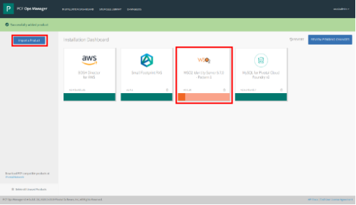
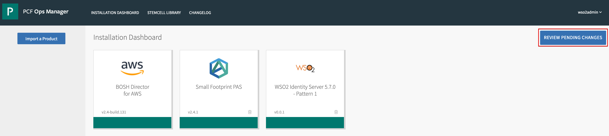

# Pivotal Cloud Foundry Resources for WSO2 Identity Server deployment pattern 1

This directory contains the BOSH release implementation and PCF tile creation resources for WSO2 Identity Server 5.7.0
[deployment pattern 1](https://docs.wso2.com/display/IS570/Deployment+Patterns#DeploymentPatterns-Pattern1-HAclustereddeploymentofWSO2IdentityServer).


For step-by-step guidelines to manage the BOSH release and to build the PCF tile, refer the following:

## Contents

* [Prerequisites](#prerequisites)
* [Create the BOSH Release](#create-the-bosh-release)
* [Build the CF tile](#build-the-cf-tile)
* [Output](#output)
* [Delete Deployment](#delete-deployment)
* [BOSH Release Structure](#bosh-release-structure)
* [References](#references)

## Prerequisites

1. Install the following software.
    - [BOSH Command Line Interface (CLI) v2+](https://bosh.io/docs/cli-v2.html)
    - [Git client](https://git-scm.com/book/en/v2/Getting-Started-Installing-Git)
    - [PCF Tile Generator](https://docs.pivotal.io/tiledev/2-3/tile-generator.html)


2. Obtain the following software distributions.
    - [WSO2 Identity Server 5.7.0](https://wso2.com/identity-and-access-management/install/) product distribution
    - [Java Development Kit (JDK) 1.8](https://adoptopenjdk.net/archive.html)
    - Relevant Java Database Connectivity (JDBC) drivers
        - [mssql-jdbc-7.0.0.jre8.jar](https://www.microsoft.com/en-us/download/details.aspx?id=57175)
        - [mysql-connector-java-5.1.45-bin.jar](https://dev.mysql.com/downloads/connector/j/)

3. Clone this Git repository.

    ```
    git clone https://github.com/wso2/pivotal-cf-is
    ```

   **Note**: In the remaining sections, the project root directory has been referred to as, **pivotal-cf-is**.

## Create the BOSH release

In order to create the BOSH release for deployment pattern 1, follow the below steps.

1. Move to root directory of the deployment pattern 1 BOSH release.

    ```
    cd pivotal-cf-is/pattern-1/bosh-release/
    ```   
2. Copy the software obtained in step 2 of [Prerequisites](#prerequisites) to the `dist` folder.

3. Create the BOSH release and export it to a tarball.
    ```
    ./create.sh
    ```

## Build the CF tile

In order to build the CF tile for deployment pattern 1, follow the below steps.

1. Move the BOSH release tarball created in the above step to the root of tile directory and navigate into it.

    ```
    mv wso2is-5.7.0-bosh-release.tgz ../tile/
    cd ../tile/
    ```   

2. Navigate to pivotal-cf-is/pattern-1/tile directory and execute build.sh
    ```
    ./build.sh
    ```
    Executing this script will generate the tile for WSO2 IS 5.7.0 deployment. The tile will be created in the root of the ```product``` folder under tile directory.

    ## Install Identity Server in PCF

    1. Log in to PCF Ops Manager and upload the tile built by clicking **Import a Product**.

    2. After the tile is uploaded, add the tile to the PCF environment by clicking the + icon next to it.
    

    3. After the tile is added to the environment, click on the Identity Server tile in the PCF environment to add configurations to the setup.               
    

      i. AZ and Network Assignments Page:
      - Place singleton jobs in: Select the AZ in which the Identity server VM needs to run. The broker runs as a singleton job
      - Balance other jobs in: Select any combination of AZs.
      - Network: Select pcf-pas-network

      Click save.

      ii. WSO2 Identity Server - BPS Datasource connection information

      - JDBC URL:

        - MySQL: `jdbc:mysql://<hostname>:<port>/<db_name>?autoReconnect=true&amp;useSSL=false`

        - MS SQL: `jdbc:sqlserver://<hostname>:<port>;databaseName=<db_name>;`

      - Driver Class Name: Select the class name of the JDBC driver relevant to the database being used.

      - Validation Query: SELECT 1

      - Username: Username for database

      - Password: Password for database

      Click Save.

      iii. WSO2 Identity Server - Registry and User Management Datasource connection information

      - JDBC URL:

        - MySQL: `jdbc:mysql://<hostname>:<port>/<db_name>?autoReconnect=true&amp;useSSL=false`

        - MS SQL: `jdbc:sqlserver://<hostname>:<port>;databaseName=<db_name>;`

      - Driver Class Name: Select the class name of the JDBC driver relevant to the database being used.

      - Validation Query: SELECT 1

      - Username: Username for database

      - Password: Password for database

      Click Save.

      iv. WSO2 Identity Server - Configuration Registry Datasource connection information

      - JDBC URL:

        - MySQL: `jdbc:mysql://<hostname>:<port>/<db_name>?autoReconnect=true&amp;useSSL=false`

        - MS SQL: `jdbc:sqlserver://<hostname>:<port>;databaseName=<db_name>;`

      - Driver Class Name: Select the class name of the JDBC driver relevant to the database being used.

      - Validation Query: SELECT 1

      - Username: Username for database

      - Password: Password for database

      Click Save.

      v. WSO2 Identity Server - Identity Datasource connection information

      - JDBC URL:

        - MySQL: `jdbc:mysql://<hostname>:<port>/<db_name>?autoReconnect=true&amp;useSSL=false`

        - MS SQL: `jdbc:sqlserver://<hostname>:<port>;databaseName=<db_name>;`

      - Driver Class Name: Select the class name of the JDBC driver relevant to the database being used.

      - Validation Query: SELECT 1

      - Username: Username for database

      - Password: Password for database

      Click Save.

      vi. Errands contain health check jobs for the Identity server nodes. These jobs check if the nodes are alive, and responding to requests as expected. These health checks begin running after the relevant nodes have been deployed. The execution of errands are enabled by default. However, users have the option to disable the execution of errands.

      vii. Resource Config contains deployment information for each job. Users have the options to change the number of instances, persistent disk types, VM types, etc. for each job.

      viii. Return to the **Installation Dashboard** in Ops Manager and click **Review Pending Changes**.            

      

      ix. Select the checkbox for Identity Server and click Apply Changes.

      

## Output

To log into the created instances, run the following commands in the BOSH directory in the Pivotal environment.

1. List all the deployments.

    ```
    bosh deployments
    ```

2. List all the instances within a deployment.

    ```
    bosh vms -d <name>
    ```
3. SSH into the vm as follows.

    ```
    bosh -d <name> ssh <instance>
    ```

4. Access the WSO2 Identity Server carbon management console using the following URL. Here the domain name refers to the domain name of the Pivotal environment where the tile is deployed.

    ```
    https://wso2is.sys.<domain_name>/carbon
    ```

## Delete deployment

1. Delete the deployment.

    ```
    bosh -d <name> delete-deployment
    ```

## BOSH release structure

Structure of the directories and files of the BOSH release is as follows:

```
└── bosh-release
    ├── config
    ├── deployment
    ├── dist
    ├── jobs
    ├── packages
    ├── src
    └── create.sh
```

## References

* [BOSH CLI v2 commands](https://bosh.io/docs/cli-v2.html)
