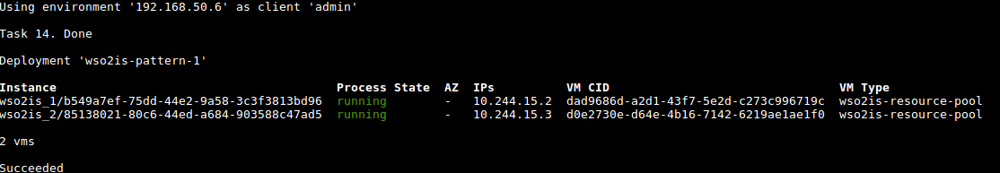

# Managing BOSH Release for WSO2 Identity Server deployment pattern 1 locally (BOSH Lite)

The following sections provide step-by-step guidelines for managing the WSO2 Identity Server 5.4.0 deployment pattern 1
BOSH release locally ([BOSH Lite](https://bosh.io/docs/bosh-lite)).


## Contents

* [Prerequisites](#prerequisites)
* [Create Release](#create-release)
* [Deploy Release](#deploy-release)
* [Output](#output)
* [Delete Release Deployment](#delete-deployment)
* [References](#references)

## Prerequisites

1. Install the following software:

    - [BOSH Command Line Interface (CLI) v2+](https://bosh.io/docs/cli-v2.html)
    - [WSO2 Update Manager (WUM)](http://wso2.com/wum)
    - [Git client](https://git-scm.com/book/en/v2/Getting-Started-Installing-Git)
    - [Oracle VM VirtualBox](https://www.virtualbox.org/manual/ch02.html)
    
2. Obtain the following software distributions.

    - WSO2 Identity Server 5.4.0 WUM updated product distribution
    - [Java Development Kit (JDK) 1.8](http://www.oracle.com/technetwork/java/javase/downloads/jdk8-downloads-2133151.html)
    - Relevant Java Database Connectivity (JDBC) connector (e.g. [MySQL JDBC driver](https://dev.mysql.com/downloads/connector/j/5.1.html)
    if the external database used is MySQL)
    
3. Clone this Git repository.

    ```
    git clone https://github.com/wso2/pivotal-cf-is
    ```
    
   **Note**: In the remaining sections, the project root directory has been referred to as, **pivotal-cf-is**.

## Create Release

In order to create the BOSH release for deployment pattern 1 using BOSH Lite, you must follow the standard steps
for creating a release with BOSH.
 
1. Move to `.deployment` directory of the deployment pattern 1 BOSH release.

    ```
    cd <pivotal-cf-is>/pattern-1/bosh-release/.deployment
    ```   
    
2. Create the local BOSH environment and login to it.

    Steps to create a BOSH environment with BOSH Lite as Director VM and login to it, can be found from
    [here](http://bosh.io/docs/bosh-lite.html#install). Once you setup the BOSH Lite environment, visit the
    VirtualBox application to confirm a new VM has been created.
    
    

3. Move back to the root directory of deployment pattern 1 BOSH release (`<pivotal-cf-is>/pattern-1/bosh-release`).

    ```
    cd ..
    ```

4. Add the WSO2 Identity Server 5.4.0 WUM updated product distribution, JDK distribution and MySQL JDBC driver in the form of release blobs.

    Assuming that,

   - the created BOSH environment (with BOSH Lite as the Director) was saved with alias `vbox`, in step 2
   - the required binaries reside within `~/Downloads` directory
    
    ```
    bosh -e vbox add-blob ~/Downloads/jdk-8u144-linux-x64.tar.gz oraclejdk/jdk-8u144-linux-x64.tar.gz
    bosh -e vbox add-blob ~/Downloads/mysql-connector-java-5.1.34-bin.jar mysqldriver/mysql-connector-java-5.1.34-bin.jar
    bosh -e vbox add-blob ~/Downloads/wso2is-5.4.0.zip wso2is/wso2is-5.4.0.zip
    ```

5. Create the BOSH Dev release.

   ```
   bosh -e vbox create-release --force
   ```
   Please refer [BOSH Documentation](https://bosh.io/docs/create-release.html#dev-release) for detailed information on creating a dev release.
   
## Deploy release

1. Setup and configure external product database(s).

    - Currently, it is expected that the external database holds the user management, registry, identity and workflow feature database tables.
    Please see WSO2 Identity Server [Documentation](https://docs.wso2.com/display/IS540/Setting+Up+Separate+Databases+for+Clustering)
    for further details.

    - Following table shows the external product database configurations, which have been set as properties under WSO2 Identity Server job specifications
    (**e.g.** see `properties` section under `<pivotal-cf-is>/pattern-1/bosh-release/jobs/wso2is_<job_number>/spec`).
    
   <br>
   
   Property | Description | Default
   -------- | ----------- | -------
   wso2is.user_ds.url | Connection URL of the user data source. | -
   wso2is.user_ds.driver | Database driver class name of the user data source. | -
   wso2is.registry_ds.url | Connection URL of the registry data source. | -
   wso2is.registry_ds.driver | Database driver class name of the registry data source. | -
   wso2is.identity_ds.url | Connection URL of the identity data source. | -
   wso2is.identity_ds.driver | Database driver class name of the identity data source. | -
   wso2is.db.username | Username of the WSO2 Identity Server product database user. | root
   wso2is.db.password | Password of the WSO2 Identity Server product database user. | root
   
   Among the above, the properties with no default values **must** be set in the deployment manifest,
   prior deployment of the release.
   If you intend to customize any of the properties with default values, you may set the customized values
   in the deployment manifest, prior to deployment of the release.
   
2. Move to the root directory of deployment pattern 1 BOSH release.

    ```
    cd <pivotal-cf-is>/pattern-1/bosh-release
    ```
    
3. Upload the deployment pattern 1 BOSH release.

    ```
    bosh -e vbox upload-release
    ```

4. Upload the desired stemcell directly to BOSH. [bosh.io](http://bosh.io/stemcells) provides a resource to find and download stemcells.

    When uploading the stemcell to BOSH Lite environment created in previous section (see example steps under section [Create Release](#create-release)),
   
    ```
    bosh -e vbox upload-stemcell https://bosh.io/d/stemcells/bosh-warden-boshlite-ubuntu-trusty-go_agent
    ```
    
5. Upload the deployment manifest.

    To upload the deployment manifest relevant to the BOSH environment,
    
    ```
    bosh -e vbox -d wso2is-pattern-1 deploy manifests/wso2is-manifest.yml
    ```
  
## Output

To find the IP addresses of created instances via the BOSH CLI and access the WSO2 Identity Server management console via a web browser,

1. List all the instances within a deployment.
    
    To find the deployed job instances in the local environment,
    ```
    bosh -e vbox -d wso2is-pattern-1 vms
    ```
    
    

2. SSH into an instance.

    ```
    bosh -e vbox -d wso2is-pattern-1 ssh wso2is_1/b549a7ef-75dd-44e2-9a58-3c3f3813bd96
    ```
    
3. Access the WSO2 Identity Server management console URL.

    ```
    https://10.244.15.2:9443/carbon/
    ```
    
## Delete release Deployment

1. Delete the deployment.

    ```
    bosh -e vbox -d wso2is-pattern-1 delete-deployment
    ```
    
    **e.g.** To delete the WSO2 Identity Server pattern 1 deployment in the BOSH Lite environment,
    
    ```
    bosh -e vbox -d wso2is-pattern-1 delete-deployment
    ```

2. **[Optional]** Cleanup the BOSH release, stemcell, disks and etc.

    ```
    bosh -e vbox clean-up --all
    ```

## References

* [BOSH CLI v2 commands](https://bosh.io/docs/cli-v2.html)
* [BOSH Lite](https://bosh.io/docs/bosh-lite.html)
