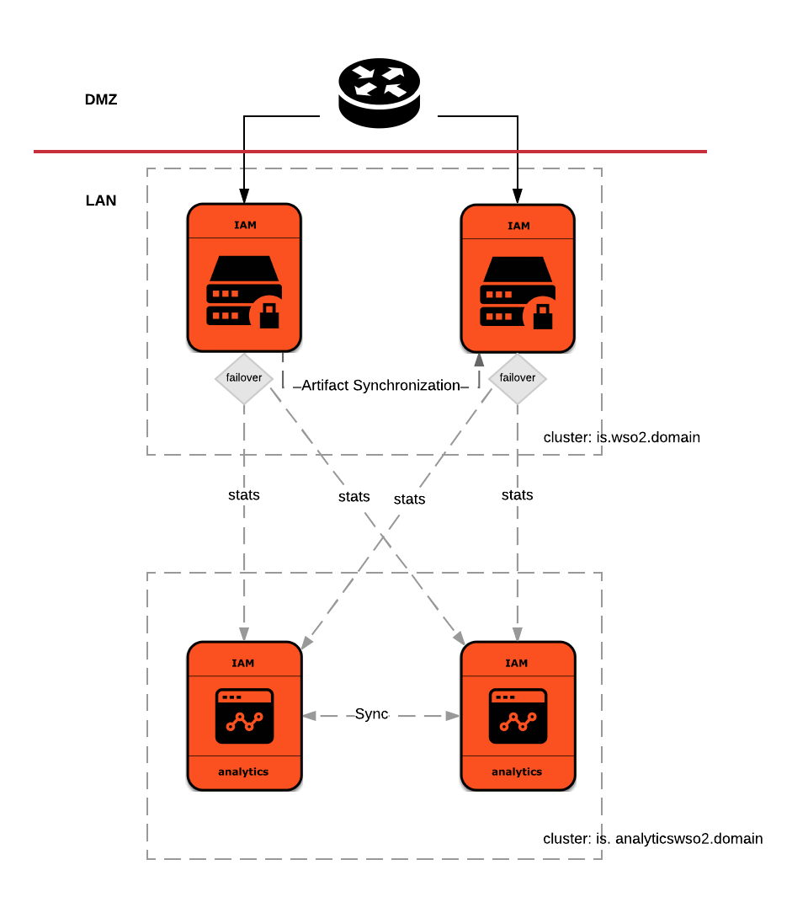

# Pivotal Cloud Foundry Resources for WSO2 Identity Server deployment pattern 2

This directory contains the BOSH release implementation and PCF tile creation resources for WSO2 Identity Server 5.7.0
[deployment pattern 2](https://docs.wso2.com/display/IS570/Deployment+Patterns#DeploymentPatterns-Pattern2-HAclustereddeploymentofWSO2IdentityServerwithWSO2IdentityAnalytics).



For step-by-step guidelines to manage the BOSH release and to build the PCF tile, refer the following:

## Contents

* [Prerequisites](#prerequisites)
* [Create the BOSH Release](#create-the-bosh-release)
* [Build the CF tile](#build-the-cf-tile)
* [Output](#output)
* [Delete Deployment](#delete-deployment)
* [BOSH Release Structure](#bosh-release-structure)
* [References](#references)

## Prerequisites

1. Install the following software.
    - [BOSH Command Line Interface (CLI) v2+](https://bosh.io/docs/cli-v2.html)
    - [Git client](https://git-scm.com/book/en/v2/Getting-Started-Installing-Git)
    - [PCF Tile Generator](https://docs.pivotal.io/tiledev/2-3/tile-generator.html)


2. Obtain the following software distributions.
    - [WSO2 Identity Server 5.7.0](https://wso2.com/identity-and-access-management/install/) product distribution
    - [WSO2 Identity Server Analytics 5.7.0](https://wso2.com/identity-and-access-management/install/analytics/) product distribution
    - [Java Development Kit (JDK) 1.8](https://adoptopenjdk.net/archive.html)
    - Relevant Java Database Connectivity (JDBC) drivers
        - [mssql-jdbc-7.0.0.jre8.jar](https://www.microsoft.com/en-us/download/details.aspx?id=57175)
        - [mysql-connector-java-5.1.45-bin.jar](https://dev.mysql.com/downloads/connector/j/)


3. Clone this Git repository.

    ```
    git clone https://github.com/wso2/pivotal-cf-is
    ```

   **Note**: In the remaining sections, the project root directory has been referred to as, **pivotal-cf-is**.

## Create the BOSH release

In order to create the BOSH release for deployment pattern 2, follow the below steps.

1. Move to root directory of the deployment pattern 2 BOSH release.

    ```
    cd pivotal-cf-is/pattern-2/bosh-release/
    ```   
2. Copy the software obtained in step 2 of [Prerequisites](#prerequisites) to the `dist` folder.

3. Create the BOSH release and export it to a tarball.
    ```
    ./create.sh
    ```

## Build the CF tile

In order to build the CF tile for deployment pattern 2, follow the below steps.

1. Move the BOSH release tarball created in the above step to the root of tile directory and navigate into it.

    ```
    mv wso2is-5.7.0-bosh-release.tgz ../tile/
    cd ../tile/
    ```   

2. Navigate to pivotal-cf-is/pattern-2/tile directory and execute build.sh
    ```
    ./build.sh
    ```
    Executing this script will generate the tile for WSO2 IS 5.7.0 deployment. The tile will be created in the root of the ```product``` folder under tile directory.

4. Upload the tile to the Pivotal Environment and configure it.

## Output

To log into the created instances, run the following commands in the BOSH directory in the Pivotal environment.

1. List all the deployments.

    ```
    bosh deployments
    ```

2. List all the instances within a deployment.

    ```
    bosh vms -d <Name>
    ```
3. SSH into the vm as follows.

    ```
    bosh -d <name> ssh <instance>
    ```

4. Access the WSO2 Identity Server management console using the following URL. Here the domain name refers to the domain name of the Pivotal environment where the tile is deployed.

    ```
    https://wso2is.sys.<domain_name>/carbon
    ```

5. Access the WSO2 Identity Server Analytics management console using the following URL. Here the domain name refers to the domain name of the Pivotal environment where the tile is deployed.

    ```
    https://wso2is.sys.<domain_name>/carbon
    ```

## Delete deployment

1. Delete the deployment.

    ```
    bosh -d <name> delete-deployment
    ```


## BOSH release structure

Structure of the directories and files of the BOSH release is as follows:

```
└── bosh-release
    ├── config
    ├── deployment
    ├── dist
    ├── jobs
    ├── packages
    ├── src
    └── create.sh
```

## References

* [BOSH CLI v2 commands](https://bosh.io/docs/cli-v2.html)
